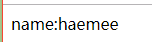
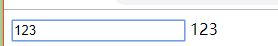
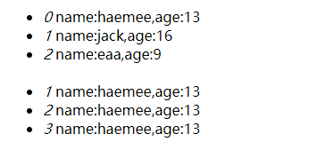

## VUE基础

#### MVC模式

1.M   Model-模型：数据
2.V   View-视图：表现层
3.C   Controller-控制器：业务逻辑


vue好在哪儿：
1.分工明确
2.工作效率高
3.统一

------------------------------------------------------------------------------------------------------------------------

改变：
1.不要直接操作DOM
2.数据为中心——数据驱动

------------------------------------------------------------------------------------------------------------------------

#### 1.数据绑定--单向  

数据绑定：
1.单向    {{输出}}      数据 => 视图

~~~html
<!DOCTYPE html>
<html>
<head>
	<title></title>
	<script src="vue.js"></script>
	<script type="text/javascript">
		window.onload=function(){
			let vm = new Vue({
				el:'#div1',
				data:{
					name:'haemee'
				}
			})
		}
	</script>
</head>
<body>
	<div id="div1">
		name:{{name}}
	</div>
</body>
</html>
~~~

效果：


#### 2.数据绑定--双向  

数据绑定：

2.双向    v-model      数据 <=> 视图

~~~~html
<!DOCTYPE html>
<html>
<head>
	<title></title>
	<script src="vue.js"></script>
	<script type="text/javascript">
		window.onload=function(){
			let vm = new Vue({
				el:'#div1',
				data:{
					txt:''
				}
			})
		}
	</script>
</head>
<body>
	<div id="div1">
		<input type="text" v-model='txt'>
		<span>{{txt}}</span>
	</div>
</body>
</html>
~~~~

效果：


#### 3.属性绑定

  v-bind:属性="数据"    相当于     :属性="数据"

  :style="json"
  :class="arr"

~~~html
<!DOCTYPE html>
<html>
<head>
	<title></title>
	<script src="vue.js"></script>
	<script type="text/javascript">
		window.onload=function(){
			let vm = new Vue({
				el:'#div1',
				data:{
					txt:'abc',
					styleJson:{
						color:'',
						display:'block',
						'font-size':'40px'
					},
				arr:['aaa','bbb','ccc']
				}
			})
		}
	</script>
</head>
<body>
	<div id="div1">
		<span v-bind:title="txt">span标签</span></br>
		<span :title="txt">span标签</span></br></br>

		<input type="text" v-model="styleJson.color">
		<span :style="styleJson">span标签</span></br></br>

		<span :class="arr">F12看class是否多了</span>

	</div>
</body>
</html>
~~~


#### 4.事件绑定

  v-on:xxx="函数"
  @xxx="函数"

~~~html
<!DOCTYPE html>
<html>
<head>
	<title></title>
	<script src="vue.js"></script>
	<script type="text/javascript">
		window.onload=function(){
			let vm = new Vue({
				el:'#div1',
				data:{
					count:0
				},
				methods:{
					add(){
						this.count++;
					},
					del(){				
						this.count--;
					}
				}
			})
		}
	</script>
</head>
<body>
	<div id="div1">
		{{count}}<br>
		<span v-on:click="add">span标签</span><br>
		<span v-on:click="del">span标签</span><br>
		
	</div>
</body>
</html>
~~~


#### 5.v-for

  v-for="val,key in 数组"
  v-for="val,key in json"

~~~html
<!DOCTYPE html>
<html>
<head>
	<title></title>
	<script src="vue.js"></script>
	<script type="text/javascript">
		window.onload=function(){
			let vm = new Vue({
				el:'#div1',
				data:{
					usersArr:[
					{name:'haemee',age:13},
					{name:'jack',age:16},
					{name:'eaa',age:9}
					],
					usersJson:{
						'1':{name:'haemee',age:13},
						'2':{name:'haemee',age:13},
						'3':{name:'haemee',age:13}
					}	
				}
			})
		}
	</script>
</head>
<body>
	<div id="div1">
		<ul>
			<li v-for="item,index in usersArr">
				<i>{{index}}  </i>name:{{item.name}},age:{{item.age}}
			</li>
			<br>
			<li v-for="item,index in usersJson">
				<i>{{index}}  </i>name:{{item.name}},age:{{item.age}}
			</li>
		</ul>
	</div>
</body>
</html>
~~~

效果：


#### 6. v-show与v-if   

v-show    display

v-if      删除

~~~html
<!DOCTYPE html>
<html>
<head>
	<title></title>
    <style media="screen">
    .box1 {width:300px; height:150px; background:green}
    .box2 {width:300px; height:150px; background:pink}
    </style>
	<script src="vue.js"></script>
	<script type="text/javascript">
		window.onload=function(){
			let vm = new Vue({
				el:'#div1',
				data:{
					showFlag:true
				},
				methods:{
					show(){
						this.showFlag = !this.showFlag
					}
				}
			})
		}
	</script>
</head>
<body>
	<div id="div1">
		<input type="button" value="on/off" @click="show">
		<div class="box1" v-show="showFlag">隐藏这个盒子</div>

		<div class="box2" v-if="showFlag">删除这个盒子--  f12可查看</div>
	</div>
</body>
</html>
~~~


v-if的应用例子

~~~html
<!DOCTYPE html>
<html>
  <head>
    <meta charset="utf-8">
    <title></title>
    <style media="screen">
    .box {width:300px; height:150px; background:#CCC}
    </style>
    <script src="vue.js" charset="utf-8"></script>
    <script>
    window.onload=function (){
      let vm=new Vue({
        el: '#div1',        //根元素
        data: {
          subscript: true
        },
        methods: {
          fnShowHide(){
            this.show=!this.show;
          }
        }
      });
    };
    </script>
  </head>
  <body>
    <div id="div1">
      <form action="http://localhost/" method="get">
        <input type="text" name="user" value="blue"><br>

        {{subscript}}
        <input type="checkbox" v-model="subscript"> 发送邮件给我
        <input v-if="subscript" type="email" name="email" value="aaa@163.com"><br>

        <input type="submit" name="" value="提交">
      </form>
    </div>
  </body>
</html>

~~~


#### 7.修饰符

1. 事件修饰符

Vue.js 为 v-on 提供了 事件修饰符。通过由点(.)表示的指令后缀来调用修饰符 

~~~
.prevent
.capture
.self
.once
~~~

~~~
<div @click='doThis' style="width:100px;height: 100px; background: red;">
    点击父元素
  <a v-on:click.stop="doThis">点击子元素
  </a>
 </div>
/*当点击父元素的时候，执行doThis,当点击子元素a的时候，这个点击动作不单单触发了a标签，同时也触发了div标签，这就是事件冒泡，所以假设上述例子中a标签为v-on:click='doThis',则doThis会被执行两次，父元素和子元素都执行了一次click事件，而.stop则是阻止事件冒泡，再次点击a标签，click事件只会执行一次*/

~~~

2. 按键修饰符

全部的按键别名：

```
.enter
.tab
.delete (捕获 “删除” 和 “退格” 键)
.esc
.space
.up
.down
.left
.right
```

~~~
<input v-on:keyup.enter="submit">
<input @keyup.enter="submit">
~~~

3. 2.1.0 新增 

可以用如下修饰符开启鼠标或键盘事件监听，使在按键按下时发生响应。

```
.ctrl
.alt
.shift
.meta
```

#### 8.计算后属性 -- computed

​          当我们想要根据一端业务代码的执行结果来返回属性的值，就可以使用计算属性computed了,

计算属性是一个有结果的函数,有get方法和set方法，get方法，必须有返回值必

简单例子:

~~~html
<!DOCTYPE html>
<html>
<head>
	<title></title>
    <script src="vue.js" charset="utf-8"></script>
	<script type="text/javascript">
		window.onload = function(){
			new Vue({
				el:'#div1',
				data:{
					n1:1,
					n2:1
				},
				computed:{
					result(){
						return this.n1*this.n2
					}
				}
			})
		}

	</script>
</head>
<body>
	<div id="div1">
		<input type="text" value="" v-model="n1">
		<input type="text" value="" v-model="n2">
		{{result}}
	</div>
</body>
</html>
~~~


demo2:计算属性的get方法和set方法

~~~html
<!DOCTYPE html>
<html>
<head>
	<title></title>
    <script src="vue.js" charset="utf-8"></script>
	<script type="text/javascript">
		window.onload = function(){
			new Vue({
				el:'#div1',
				data:{
					first:'',
					last:''
				},
				computed:{
					name:{
						get(){
							return this.first+this.last
						},
						set(newVal){
							this.first = newVal.charAt(0);
							this.last = newVal.substring(1)
						}
					}
				}
			})
		}

	</script>
</head>
<body>
	<div id="div1">
		<input type="text" value="" v-model="first">
		<input type="text" value="" v-model="last">
		{{name}}
		<br>
		<input type="text" v-model="name">
	</div>
</body>
</html>
~~~


#### 9.监听 -- watch

Vue.js 提供了一个方法 watch，它用于观察Vue实例上的数据变动。对应一个对象，键是观察表达式，值是对应回调。值也可以是方法名，或者是对象，包含选项。 

~~~html
<!DOCTYPE html>
<html>
<head>
	<title></title>
    <script src="vue.js" charset="utf-8"></script>
	<script type="text/javascript">
		window.onload = function(){
			new Vue({
				el:'#div1',
				data:{
					a:'null'
				},
				watch:{
					a(newVal,oldVal){
						console.log(`a变了，从${oldVal}变成${newVal}`)
					}
				}
			})
		}

	</script>
</head>
<body>
	<div id="div1">
		<input type="text" value="" v-model="a">
	</div>
</body>
</html>
~~~


#### 10.计算后+监听

~~~
<!DOCTYPE html>
<html>
<head>
	<title></title>
    <script src="vue.js" charset="utf-8"></script>
	<script type="text/javascript">
		window.onload = function(){
			new Vue({
				el:'#div1',
				data:{
					a: ''
				},
				computed:{
					c(){
						return this.a + 'xx'
					}
				},
				watch:{
					c(newVal,oldVal){
						console.log(`a变了，从${oldVal}变成${newVal}`)
					}
				}
			})
		}

	</script>
</head>
<body>
	<div id="div1">
		<input type="text" value="" v-model="a">
	</div>
</body>
</html>
~~~


