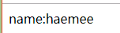
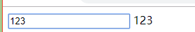
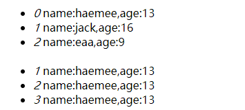

## VUE基础

#### MVC模式

1.M   Model-模型：数据
2.V   View-视图：表现层
3.C   Controller-控制器：业务逻辑

1.分离——简洁、测试
2.分工

------------------------------------------------------------------------------------------------------------------------

vue好在哪儿：
1.分工明确
2.工作效率高
3.统一

------------------------------------------------------------------------------------------------------------------------

改变：
1.不要直接操作DOM
2.数据为中心——数据驱动

------------------------------------------------------------------------------------------------------------------------

#### 1.数据绑定--单向  

数据绑定：
1.单向    {{输出}}      数据 => 视图

~~~html
<!DOCTYPE html>
<html>
<head>
	<title></title>
	
	
</head>
<body>
	

		name:{{name}}
	

</body>
</html>
~~~

效果：

#### 2.数据绑定--双向  

数据绑定：

2.双向    v-model      数据 <=> 视图

~~~~html
<!DOCTYPE html>
<html>
<head>
	<title></title>
	
	
</head>
<body>
	

		<input type="text" v-model='txt'>
		{{txt}}
	

</body>
</html>
~~~~

效果：

#### 3.属性绑定

  v-bind:属性="数据"    相当于     :属性="数据"

  :style="json"
  :class="arr"

~~~html
<!DOCTYPE html>
<html>
<head>
	<title></title>
	
	
</head>
<body>
	

		span标签 
		span标签  

		<input type="text" v-model="styleJson.color">
		span标签  

		F12看class是否多了

	

</body>
</html>
~~~

#### 4.事件绑定

  v-on:xxx="函数"
  @xxx="函数"

~~~html
<!DOCTYPE html>
<html>
<head>
	<title></title>
	
	
</head>
<body>
	

		{{count}} 
		span标签 
		span标签 
		
	

</body>
</html>
~~~

#### 5.循环

  v-for="val,key in 数组"
  v-for="val,key in json"

~~~html
<!DOCTYPE html>
<html>
<head>
	<title></title>
	
	
</head>
<body>
	

		<ul>
			<li v-for="item,index in usersArr">
				<i>{{index}}  </i>name:{{item.name}},age:{{item.age}}
			</li>
			 
			<li v-for="item,index in usersJson">
				<i>{{index}}  </i>name:{{item.name}},age:{{item.age}}
			</li>
		</ul>
	

</body>
</html>
~~~

效果：

#### 6. v-show与v-if   

v-show    display

v-if      删除

~~~html
<!DOCTYPE html>
<html>
<head>
	<title></title>
    
	
	
</head>
<body>
	

		<input type="button" value="on/off" @click="show">
		
隐藏这个盒子

		
删除这个盒子--  f12可查看

	

</body>
</html>
~~~

v-if的应用例子

~~~html
<!DOCTYPE html>
<html>
  <head>
    <meta charset="utf-8">
    <title></title>
    
    
    
  </head>
  <body>
    

      <form action="http://localhost/" method="get">
        <input type="text" name="user" value="blue"> 

        {{subscript}}
        <input type="checkbox" v-model="subscript"> 发送邮件给我
        <input v-if="subscript" type="email" name="email" value="aaa@163.com"> 

        <input type="submit" name="" value="提交">
      </form>
    

  </body>
</html>

~~~

#### 

