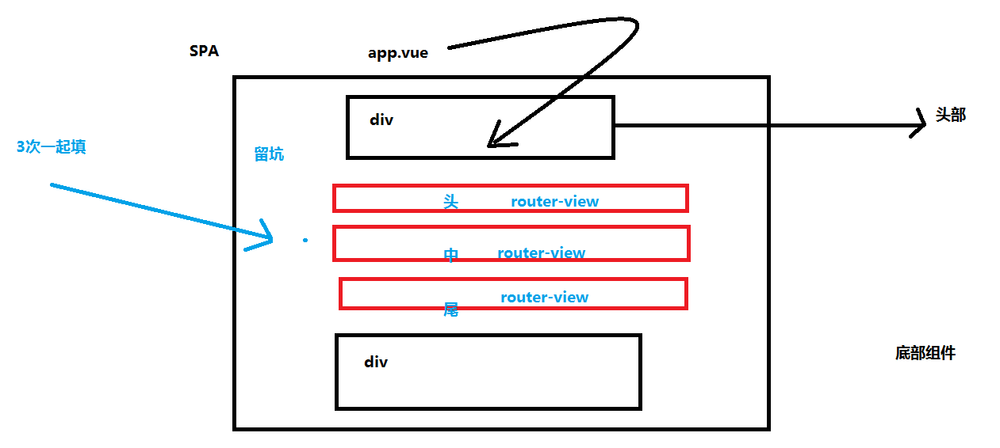

实现如下功能

~~~
const routes =[
	{
		path:'/',
		components:{
			header:header,
			footer:footer,
			default:tooter
		}
	}
]
-----
            <!-- 留坑，非常重要 坑名-->
            <router-view class="b" name="header"></router-view>
            <router-view class="b" ></router-view>
            <router-view class="b" name="footer"></router-view>
~~~

